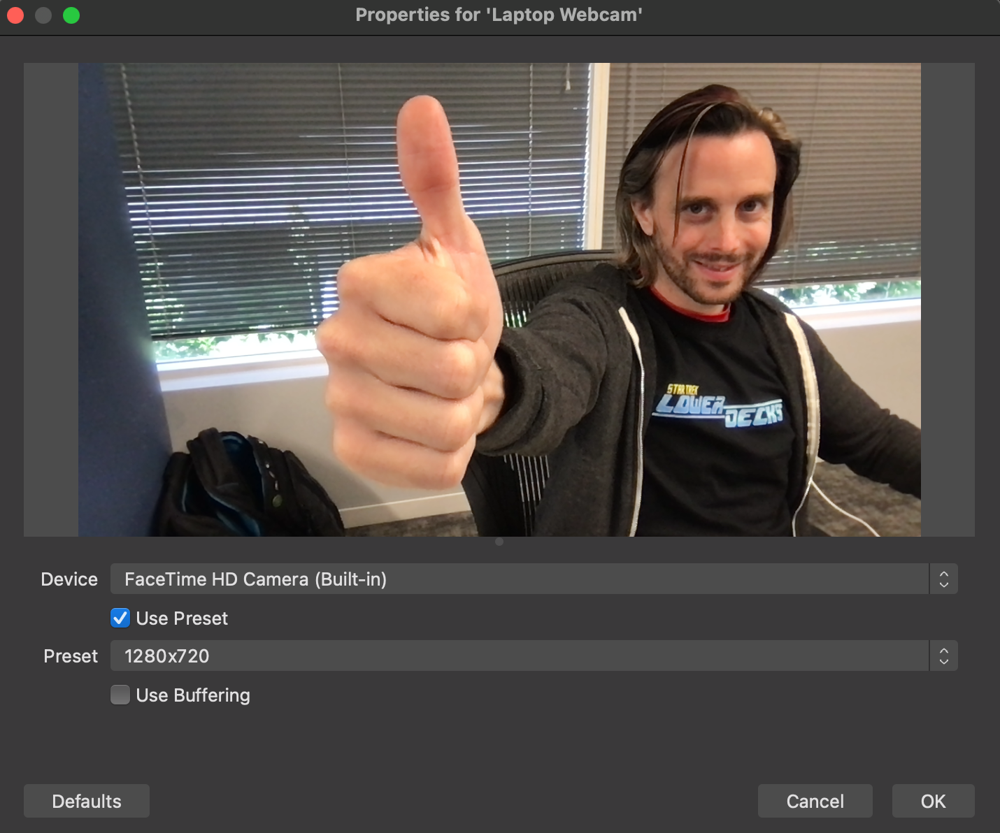

# Setting up OBS

OBS is very complex, powerful and configurable. Here's the basics you'll need to point OBS at your locally running Stooky Bill instance so it can send a test stream. You can find many videos online on how to get creative with OBS. These steps are for bare-bones manual testing.

### Point OBS at the local StookyBill instance

  1. Create a new `Profile` and name it as you like
  
  1. Open `Preferences`
  
  1. Point OBS at the local StookyBill  
  Use `Custom...` from the Service list
  Type in the URL `rtmp://localhost:1935/live` and the Stream Key
  
  1. Click `Apply` to save and then click `OK` to close the popup

### Setup Video

  1. For this basic walkthrough, we'll use `Studio Mode`
  
  1. Create a new `Scene Collection` and name it as you like
  
  1. Creete a new `Scene` -or- you could rename `scene` as you like
  
  1. Create a new `Source` for your `Scene` and select `Video Capture Device` as its type
  
  
  1. You'll see a popup, select which connected camera you'd like to use
  
  
  1. Resize the camera feed to taste in the preview box (Today, I like strong black borders)
  
  1. Click `Transition` to take what you've setup in `Preview` to `Program` otherwise you'll only ever send a black screen.
  

### Setup Audio
   Audio on OBS is extremely complex and easy to misconfigure. Forwarned, there are YouTube videos which you can search for online on how to debug and fix audio issues. This audio setup is meant as a bare-bones proof-of-concept and is not OBS production best practice. To solve annoying audio feedback issues while testing, you may wish to use headphones or playback an audio media source instead of using the built-in mic with speakers like I'm about to walk you through. This section only matters if you need to validate that you're geting audio with video, checking audio quality, and correcting audio/video sync issues in StookyBill.

  1. Open `Preferences` and Select `Audio`
  In `Global Audio Devices` From the dropdown, select your internal microphone for the first `Mic/Auxiliary Audio` field
  
  1. Click `Apply` to save and then click `OK` to close the popup
  1. Test your mic by making a sudden loud noise such as snapping your fingers. You should see the audio level spike to red and yellow.
  
  

### Start Streaming

  1. Click the `Start Streaming` button
  
  1. If your local StookyBill is not running, you will see this popup error message:  
  Caveat - you will also see this error message if you mis-typed the RTMP url `rtmp://localhost:1935/live`
  

### Checking the Logs

  - `Help > Log Files` contains a number of ways you can track and debug OBS errors it encounters running against StookyBill locally or elsewise.
  - OBS also provides [This Log Analyzer](https://obsproject.com/tools/analyzer) to help point out and diagnose potential root causes in large log files.
 
=> back to [Manual Testing](manual_testing.md)  
=> back to [README](../README.md)