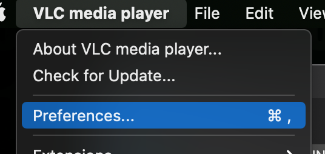
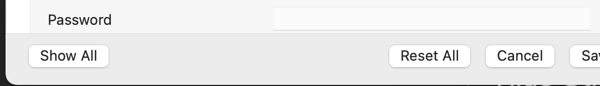
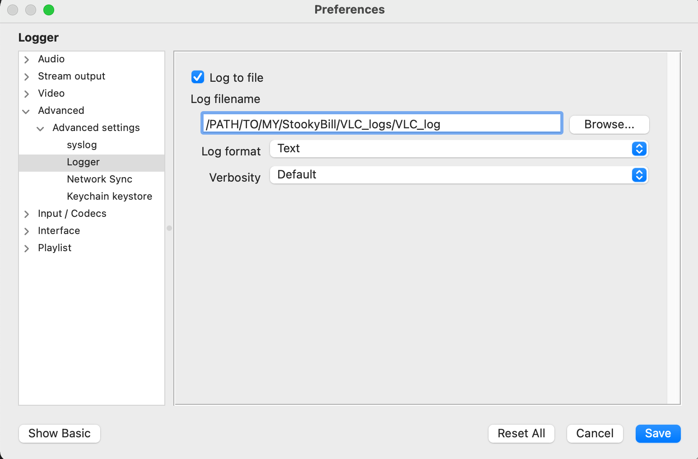
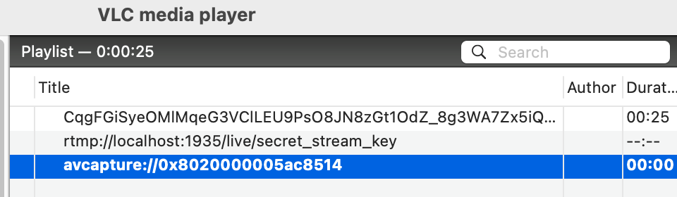
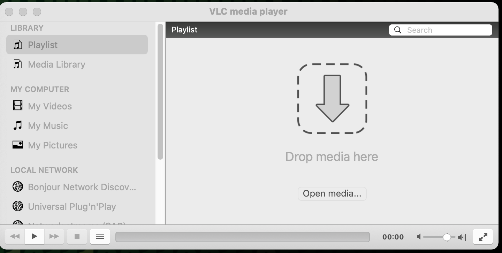
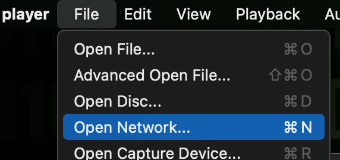
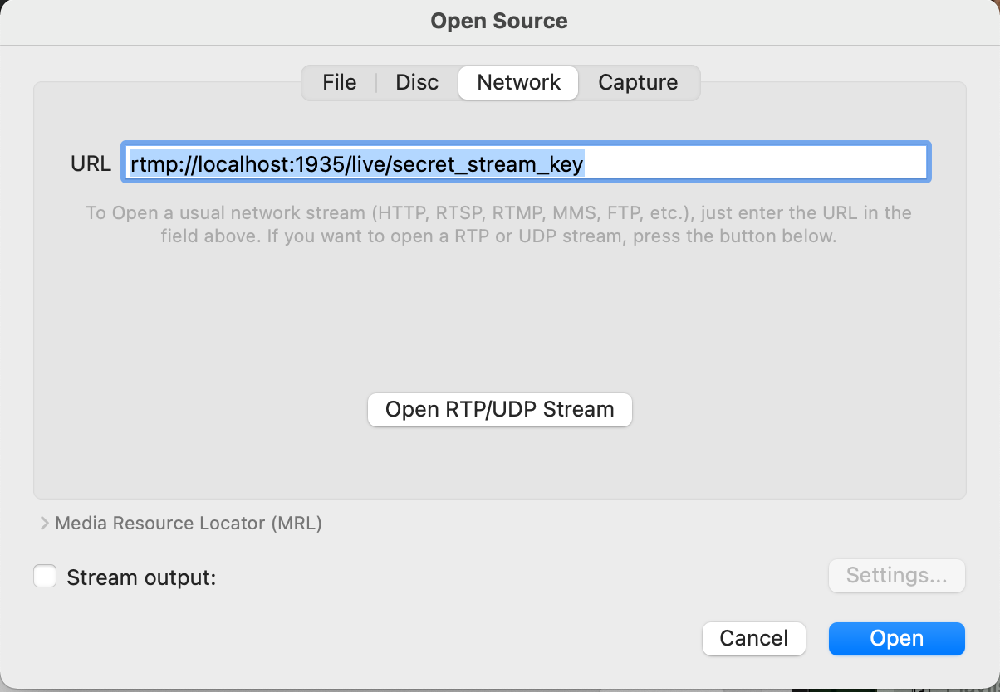

# Setting up VLC

### setting up logging:

1. In the project root, create a file and directory to contain your logs  
`mkdir VLC_logs && touch VLC_logs/VLC_log`  
This is also a great place to house scratch files since it's .gitignored

1. Open `Preferences` 


1. Click `Show All`


1. Configure Logging to point to your logfile  
_and make sure to check the `Log to file` box!_  
You can set the Verbosity how you like.
Click `Save`


Here's an exaple of a healthy log:
```
-- logger module started --
main: Running vlc with the default interface. Use 'cvlc' to use vlc without interface.
main: playlist is empty
bonjour: starting discovery
bonjour: stopped discovery
videotoolbox: Using Video Toolbox to decode 'h264'
mpeg4audio: AAC channels: 2 samplerate: 44100
main error: buffer deadlock prevented
videotoolbox: Using Video Toolbox to decode 'h264'
main error: buffer deadlock prevented
videotoolbox: vt cvpx chroma: 420v
videotoolbox: Raising max DPB to 3
```

Here's an example of when the player tries to access a stream and the server is down:
```
avcodec error: Failed to open rtmp://localhost:1935/live/secret_stream_key: Connection refused
```

Here's an example of what you might see in the playlist

Line 1 is a `.m3u8` stream file source from Twitch  
Line 2 is a local StookyBill instance URL  
Line 3 is the direct feed from the laptop's webcam

### connecting to the local StookyBill bradcaster

1. Click `Open Media` -or- `Open Network`



1. Type in the URL for the local StookyBill server, app, and stream key  
Click `Open`


### sanity checking

 - [try viewing a live stream on twitch with vlc](https://youtu.be/BQgNbIMCSGk)  
Note: this only works for live streams and reruns, not videos on demand  
This method employs [.m3u8 stream files](https://en.wikipedia.org/wiki/M3U)
 - Try accessing you laptop's camera directly with `File > Open Capture Device`  
 This method will sometimes produce interesting error messages in the VLC_log for you to get used to what video quality degradations are associated with what error logs.

=> back to [Manual Testing](manual_testing.md)  
=> back to [README](../README.md)